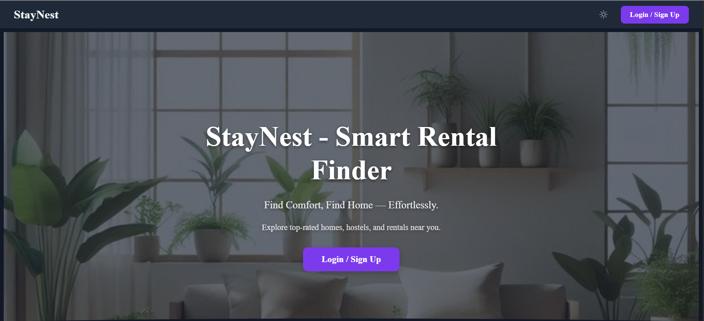
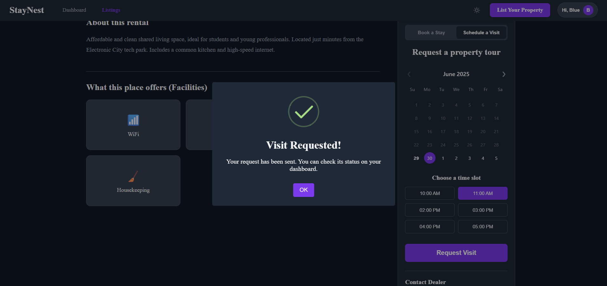

# StayNest - A Modern Rental Application

<p align="center">
  
</p>


**StayNest** is a comprehensive, full-stack web application designed to demonstrate a modern property rental experience. This project was built to showcase a deep understanding of the entire development lifecycle, from robust backend API design with Flask to sophisticated, component-based frontend development with React.

While the complete user flow is a work in progress, the application successfully implements a wide range of advanced features, including secure authentication, dynamic UI rendering, and a clean, themeable design.

---

### Implemented Features & Core Competencies

This project successfully demonstrates expertise in the following areas:

-   **Secure Authentication & User Management:**
    -   A complete user registration and login system built from the ground up.
    -   Secure password handling using **Flask-Bcrypt** for hashing.
    -   Robust session management via **JWT (JSON Web Tokens)**, with both access and refresh tokens handled by **Flask-JWT-Extended**.

-   **Modern Frontend with React:**
    -   A highly responsive and dynamic user interface built with **React 19** and **Vite**.
    -   Clean, client-side routing managed by **React Router**.
    -   Global state management (user, theme) using the **React Context API**.
    -   A beautiful, user-friendly UI with both **Light and Dark Modes**.

-   **Robust Backend API with Flask:**
    -   A well-structured RESTful API providing endpoints for all user actions.
    -   Database modeling and interaction managed by **SQLAlchemy**.
    -   Systematic database schema changes handled by **Flask-Migrate**.
    -   Correct **CORS** configuration for a decoupled development environment.

-   **Interactive User Interface Components:**
    -   An intuitive, multi-step **Preference Setup** flow for new users.
    -   A filterable **Listings Page** to browse properties.
    -   A detailed property page with a multi-image gallery and **Lightbox** for zoomed views.
    -   An interactive **Booking Widget** with a date-picker and confirmation pop-ups using `SweetAlert2`.
    -   A professional **Dashboard UI** designed to be the central hub for user activity.

---

### Project Goals & Future Development

While the core foundation is strong, the primary goal for future development is to resolve the final state management challenges to perfect the end-to-end user experience.

-   **[In Progress] Dashboard State Synchronization:** The immediate next step is to ensure the user dashboard reliably fetches and displays new bookings and visits in real-time after an action is completed. The current challenge lies in solving a stubborn state or caching issue that prevents the UI from updating, even though the backend API calls are successful.

-   **[Next Up] Preference-Based Filtering:** The backend and frontend have been built to support filtering listings based on user preferences. The next task is to connect these two systems so that the choices made during the preference setup are automatically applied to the listings page.

---

###  Tech Stack

| Area      | Technology                                    |
| --------- | --------------------------------------------- |
| **Frontend**  | React, Vite, React Router, Axios, SweetAlert2 |
| **Backend**   | Python, Flask, Flask-RESTful                  |
| **Database**  | SQLite, SQLAlchemy, Flask-Migrate             |
| **Auth**      | JWT (Flask-JWT-Extended), Flask-Bcrypt        |
| **Styling**   | CSS with Custom Properties (Variables)        |

---

### Local Development Setup

To run this project locally, you will need two terminals running simultaneously.

#### Prerequisites
- Python 3.10+ and Pip
- Node.js 18+ and NPM

#### Backend Server
1.  **Clone the repository**
    ```sh
    git clone https://github.com/Lakshmi-ANair/Stay-Nest-A-Modern-Rental-Application.git
    cd Stay-Nest-A-Modern-Rental-Application
    ```
2.  **Navigate to the backend and set up the virtual environment**
    ```sh
    cd backend
    python -m venv venv
    source venv/bin/activate  # On macOS/Linux
    # venv\Scripts\activate    # On Windows
    pip install -r requirements.txt
    ```
3.  **Initialize and upgrade the database**
    ```sh
    # If you have an old 'instance' folder, delete it first for a clean start
    flask db upgrade
    ```
4.  **Run the Flask server**
    ```sh
    flask run --port=5001
    ```
    _The backend will now be running on `http://localhost:5001`._

#### Frontend Server
1.  **Open a new terminal** and navigate to the `frontend` directory:
    ```sh
    cd frontend
    ```
2.  **Install NPM packages**
    ```sh
    npm install
    ```
3.  **Run the React development server**
    ```sh
    npm run dev
    ```
    _The frontend will now be available at `http://localhost:5173`._

---

###  Application Gallery

_A visual tour of the StayNest platform._

### **User Onboarding & Authentication**

| First Screen | Signup | Login | Preference Setup 1 |
|:------------:|:------:|:-----:|:------------------:|
|  |  |  |  |

| Preference Setup 2 | Preference Setup 3 | Preference Setup 4 | Preference Setup 5 |
|:------------------:|:------------------:|:------------------:|:------------------:|
|  |  |  |  |

---

### **Core Application Features**

| Listings Page 1 | Listings Page 2 | Listings Page 3 |
|:---------------:|:---------------:|:---------------:|
|  |  |  |

| Listing Detail 1 | Listing Detail 2 |
|:----------------:|:----------------:|
|  |  |

| Booking Confirmation 1 | Booking Confirmation 2 | Booking Confirmation 3 |
|:----------------------:|:----------------------:|:----------------------:|
|  |  |  |

| Booking Confirmation 4 | Booking Confirmation 5 | Booking Confirmation 6 |
|:----------------------:|:----------------------:|:----------------------:|
|  |  |  |

| Dashboard | Listing New Property | Logout |
|:---------:|:--------------------:|:------:|
|  | | |
---
